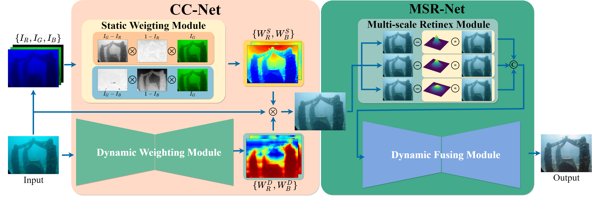
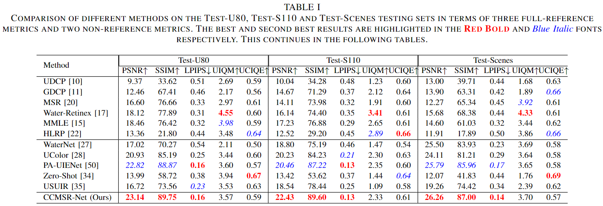
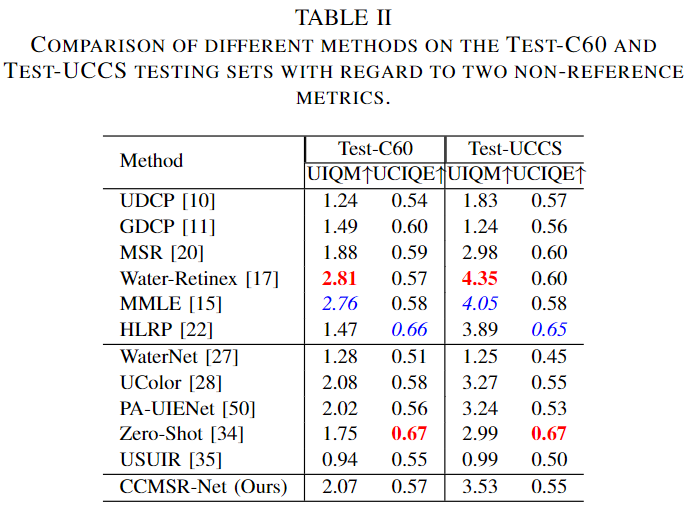
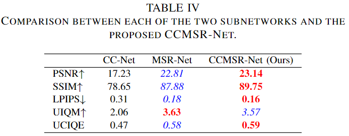

 

# Architecture

### Shared Encoder-Decoder Network

# Usage
### Installation:
1. Create the environment from the <kbd>environment.yml</kbd> file:

        conda env create -f environment.yml

2. Activate the new environment:

        conda activate uie

3. Verify that the new environment was installed correctly:

        conda env list

You can also use <kbd>conda info --envs</kbd>.

### Train:
Use this line to train the model

        python train.py --cuda_id 0 --exp CCMSRNet.yml
### Test:
Use this line to predict results

        python test.py --cuda_id 0 --exp CCMSRNet.yml --ckpt ./weights/checkpoint.pth --input path_to_img_folder --output path_to_save_folder

# Results

**Please note that there is a minor bug in the script that we used for computing the UCIQE metric, resulting in the lower values. We do sincerely apology for this mistake. To obtain accurate UCIQE values, please use the script "calculate_metrics.m" instead. The corrected results are shown below.**

# Citation
If our work is useful for your research, please cite our work

        @ARTICLE{10336777,
         author={Qi, Hao and Zhou, Huiyu and Dong, Junyu and Dong, Xinghui},
         journal={IEEE Transactions on Geoscience and Remote Sensing}, 
         title={Deep Color-Corrected Multi-scale Retinex Network for Underwater Image Enhancement}, 
         year={2023},
         doi={10.1109/TGRS.2023.3338611}}
